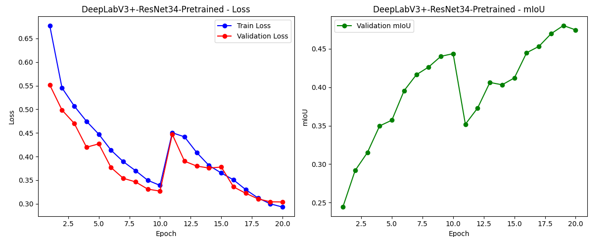
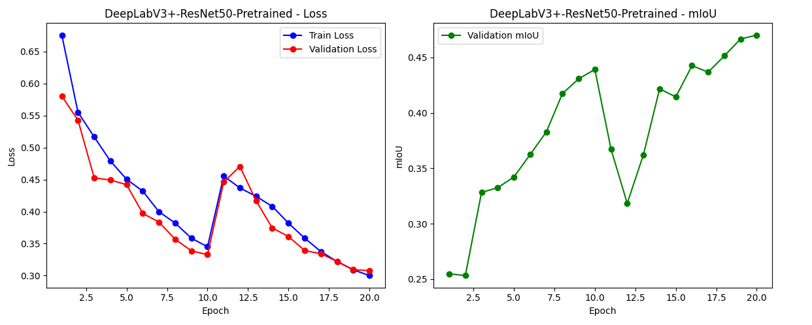
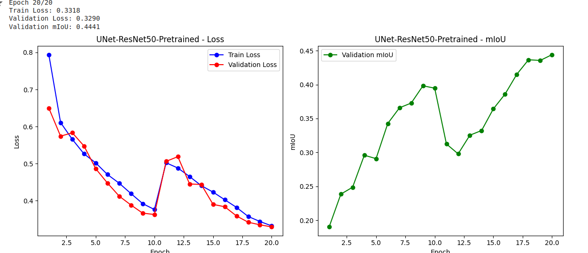
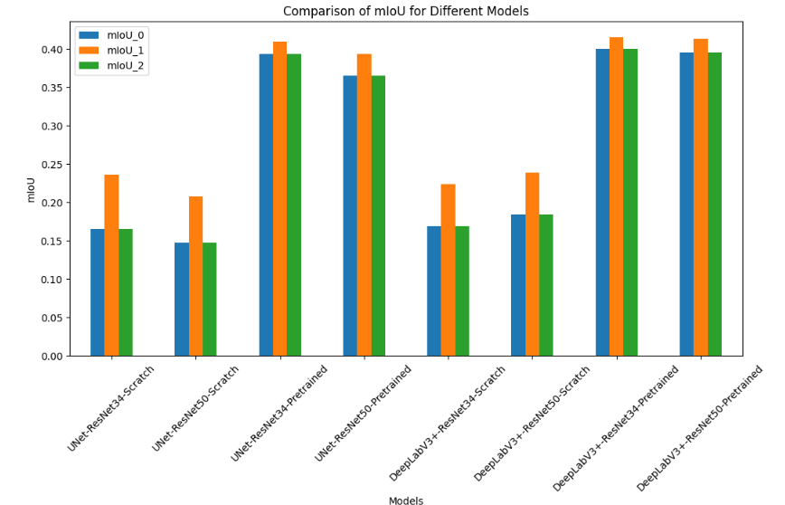

# Иерархическая Семантическая Сегментация на Датасете Pascal-part

## Введение

Этот проект посвящен **иерархической семантической сегментации**. Задача заключается в сегментации изображений на несколько классов, организованных в иерархическую структуру. Мы использовали датасет Pascal-part, который содержит изображения и их маски сегментации, классифицированные по семи категориям, от фонового класса до более детализированных классов, таких как "head" и "low_leg".

## Установка и настройка окружения

Следуйте инструкциям ниже для настройки среды и запуска Jupyter ноутбука.

### 1. Клонирование репозитория

```bash
git clone https://github.com/Nanashi1Kuro/Pascal-Hierarchical-Semantic-Segmentation.git
cd Hierarchical-Semantic-Segmentation
```
### 2. Создание и активация виртуального окружения

Для создания и активации виртуального окружения выполните следующие шаги:

**Создайте виртуальное окружение**

   ```bash
   python -m venv env
   ```
   Активируйте виртуальное окружение:
    Для Linux/Mac:
    ```bash
    source env/bin/activate 
    ```
### 3. Установка зависимостей
Обновите pip и установите зависимости из requirements.txt:

    ```bash
    pip install --upgrade pip
    pip install -r requirements.txt   
    ```
### 4. Установка и запуск Jupyter Notebook
Установите Jupyter Notebook и запустите

   ```bash
   pip install jupyter
   jupyter notebook
   ```

Эта команда откроет Jupyter Notebook в вашем веб-браузере. Вы можете открыть и работать с файлом Segmentation.ipynb.

### Структура репозитория

```plaintext
/Pascal-Hierarchical-Semantic-Segmentation
├── articles
│   ├── Hierarchical_semantic_segmentation_of_image_scene_.pdf
│   ├── Hierarchical Semantic Segmentation using Psychometric Learning.pdf
│   └── Li_Deep_Hierarchical_Semantic_Segmentation_CVPR_2022_paper.pdf
├── data
│   ├── classes.txt
│   ├── gt_masks
│   │   ├── 2008_000003.npy
│   │   ├── 2008_000008.npy
│   ├── JPEGImages
│   │   ├── 2008_000003.jpg
│   │   ├── 2008_000008.jpg
│   ├── train_id.txt
│   └── val_id.txt
├── models
│   ├── DeepLabV3+-ResNet34-Pretrained.pth
│   ├── UNet-ResNet34-Pretrained.pth
│   └── UNet-ResNet50-Pretrained.pth
├── Segmentation.ipynb
└── .images
    ├── DeepLabV3-ResNet34-Pretrained.png
    ├── DeepLabV3+-ResNet34-Scratch.png
    ├── DeepLabV3-ResNet50-Pretrained.png
    ├── DeepLabV3-ResNet50-Scratch.png
    ├── mIoU_all_model.png
    ├── UNet-ResNet34-Pretrained.png
    ├── UNet-ResNet34-Scratch.png
    └── UNet-ResNet50-Pretrained.png
```

## Описание Датасета

Датасет Pascal-part состоит из:
- **Изображений**: Хранятся в папке `JPEGImages` в формате JPEG.
- **Масок**: Хранятся в папке `gt_masks` в формате NumPy массивов. Эти маски можно загрузить с помощью `numpy.load()`.

Классы в датасете организованы следующим образом:
1. **background** (фон)
2. **body** (тело)
   - **upper_body** (верхняя часть тела)
     - **low_hand** (нижняя часть руки)
     - **up_hand** (верхняя часть руки)
     - **torso** (туловище)
     - **head** (голова)
   - **lower_body** (нижняя часть тела)
     - **low_leg** (нижняя часть ноги)
     - **up_leg** (верхняя часть ноги)


## Метрики

Для оценки качества сегментации используется метрика **mean Intersection over Union (mIoU)**. Эта метрика позволяет оценить точность сегментации путем вычисления средней степени перекрытия между предсказанными и истинными масками для каждого класса.

### Формула mIoU

1. **IoU** (Intersection over Union) для одного класса `c` рассчитывается как:

   }{\text{Union}(P_c%2C%20G_c)})

   где:
   - <code>P<sub>c</sub></code> — пиксели, предсказанные моделью как класс <code>c</code>,
   - <code>G<sub>c</sub></code> — истинные пиксели класса <code>c</code>.

   <p><strong>Intersection</strong> — это количество пикселей, которые принадлежат и предсказанному, и истинному классу. <strong>Union</strong> — это количество пикселей, которые принадлежат хотя бы одному из классов.</p>

2. **mIoU** для всех классов рассчитывается как среднее значение IoU по всем классам, исключая фоновый класс:

   

   где:
   - <code>N</code> — количество классов, кроме фонового класса.

### Почему мы используем mIoU?

- <strong>Информативность</strong>: mIoU позволяет учитывать как количество правильно сегментированных пикселей, так и количество ошибочно классифицированных пикселей.
- <strong>Отсутствие смещения</strong>: Среднее значение по всем классам позволяет избежать смещения, которое может возникнуть при оценке только одного класса или при наличии классов с неравномерным распределением.
- <strong>Сравнимость</strong>: mIoU является стандартной метрикой в задачах семантической сегментации, что делает результаты сравнимыми с результатами других исследований и методов.

## Выбор Моделей

В нашем проекте мы использовали следующие модели:

1. **UNet**:
   - **UNet-ResNet34-Scratch** и **UNet-ResNet50-Scratch**: Обучены с нуля на базе энкодеров ResNet34 и ResNet50 соответственно. Эти модели позволяют нам увидеть, как модели, обученные с нуля, справляются с задачей.
   - **UNet-ResNet34-Pretrained** и **UNet-ResNet50-Pretrained**: Используют предобученные энкодеры. Это позволяет моделям быстрее достигать хороших результатов, используя предварительные знания.

2. **DeepLabV3+**:
   - **DeepLabV3+-ResNet34-Scratch** и **DeepLabV3+-ResNet50-Scratch**: Обучены с нуля, но включают современные архитектурные улучшения, такие как механизм внимания, который помогает модели учитывать контекст изображения.
   - **DeepLabV3+-ResNet34-Pretrained** и **DeepLabV3+-ResNet50-Pretrained**: Используют предобученные энкодеры для улучшения результатов.

### Обоснование Выбора Моделей

- **UNet**: Известен своей эффективной архитектурой для сегментации, особенно в задачах с высоким разрешением. Подходит для базовой проверки.
- **DeepLabV3+**: Использует улучшенные архитектурные решения, такие как механизм внимания, что позволяет более точно учитывать контекст и детали изображения.

## Процесс Обучения

Каждая модель обучалась на датасете Pascal-part с использованием следующих параметров:
- **Количество эпох**: 20
- **Размер батча**: 16
- **Оптимизатор**: Adam
- **Планировщик**: CosineAnnealingWarmRestarts
- **Функция потерь**: CrossEntropyLoss

### Визуализация Процесса Обучения

В процессе обучения отслеживались потери и значения mIoU. Это позволило анализировать, как каждая модель улучшалась.

- График потерь для **DeepLabV3-ResNet34-Pretrained**:
  
- График потерь для **DeepLabV3-ResNet50-Pretrained**:
  
- График потерь для **UNet-ResNet50-Pretrained**:
  
- График mIoU для различных моделей:
  

## Результаты и Выводы

### Таблица Результатов

| Модель                          | mIoU<sup>0</sup> (body) | mIoU<sup>1</sup> (upper_body, lower_body) | mIoU<sup>2</sup> (low_hand, up_hand, torso, head, low_leg, up_leg) |
|---------------------------------|-------------------------|------------------------------------------|-------------------------------------------------------------------|
| UNet-ResNet34-Scratch           | 0.1654                  | 0.2359                                   | 0.1654                                                            |
| UNet-ResNet50-Scratch           | 0.1473                  | 0.2079                                   | 0.1473                                                            |
| UNet-ResNet34-Pretrained        | 0.3939                  | 0.4095                                   | 0.3939                                                            |
| UNet-ResNet50-Pretrained        | 0.3659                  | 0.3942                                   | 0.3659                                                            |
| DeepLabV3+-ResNet34-Scratch     | 0.1692                  | 0.2238                                   | 0.1692                                                            |
| DeepLabV3+-ResNet50-Scratch     | 0.1843                  | 0.2387                                   | 0.1843                                                            |
| DeepLabV3+-ResNet34-Pretrained  | 0.4008                  | 0.4154                                   | 0.4008                                                            |
| DeepLabV3+-ResNet50-Pretrained  | 0.3957                  | 0.4140                                   | 0.3957                                                            |

### Основные Выводы

1. **Предобученные модели** показывают значительно лучшие результаты по сравнению с моделями, обученными с нуля. Это подтверждает эффективность использования предварительного обучения на больших объемах данных.
2. **Модели DeepLabV3+** демонстрируют лучшие результаты по сравнению с UNet. Это связано с современными архитектурными улучшениями, такими как механизм внимания, который помогает лучше учитывать контекст изображения.
3. **Лучшие результаты** показала **DeepLabV3+-ResNet50-Pretrained**, которая продемонстрировала наивысшие значения mIoU по всем уровням иерархии. Это указывает на её высокую эффективность для задачи иерархической семантической сегментации.

## Обзор Статей

1. **[Hierarchical Semantic Segmentation of Image Scene with Object Labeling](./articles/Hierarchical_semantic_segmentation_of_image_scene_.pdf)**  
   В статье предложен метод иерархической сегментации, который включает как сценовый, так и объектный уровни. Используется модель на основе графов для сцены и геодезическая пропагация для объектов, что позволяет более точно сегментировать изображение.

2. **[Hierarchical Semantic Segmentation using Psychometric Learning](./articles/Hierarchical%20Semantic%20Segmentation%20using%20Psychometric%20Learning.pdf)**  
   В статье предложен метод психометрического тестирования для сбора аннотаций. Этот метод помогает создавать более точные аннотации для иерархической семантической сегментации, используя глубокое обучение для построения эмбеддингов изображений.

3. **[Deep Hierarchical Semantic Segmentation](./articles/Li_Deep_Hierarchical_Semantic_Segmentation_CVPR_2022_paper.pdf)**  
   В статье представлена структура HSSN, которая использует иерархию классов для улучшения сегментации. Включает улучшения для лучшего представления пикселей и улучшения результатов сегментации.

## Заключение

В этом проекте мы провели детальный анализ различных моделей для задачи иерархической семантической 
сегментации. Результаты показали, что предобученные модели DeepLabV3+ превосходят другие модели 
как по общим, так и по детализированным mIoU метрикам. Это исследование демонстрирует важность 
использования современных архитектурных решений и предварительного обучения для достижения 
лучших результатов в задачах сегментации.

